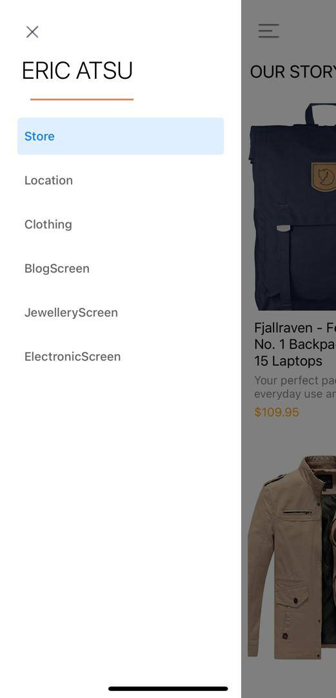
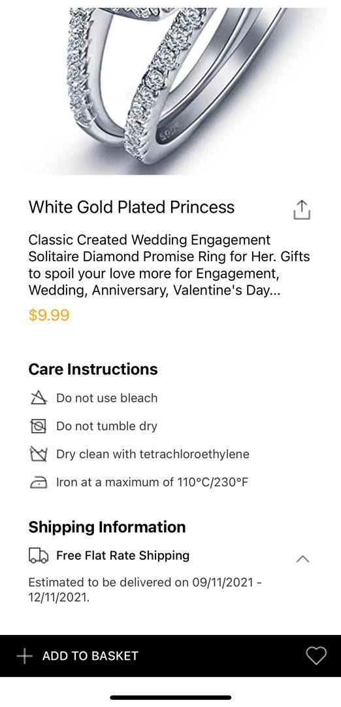
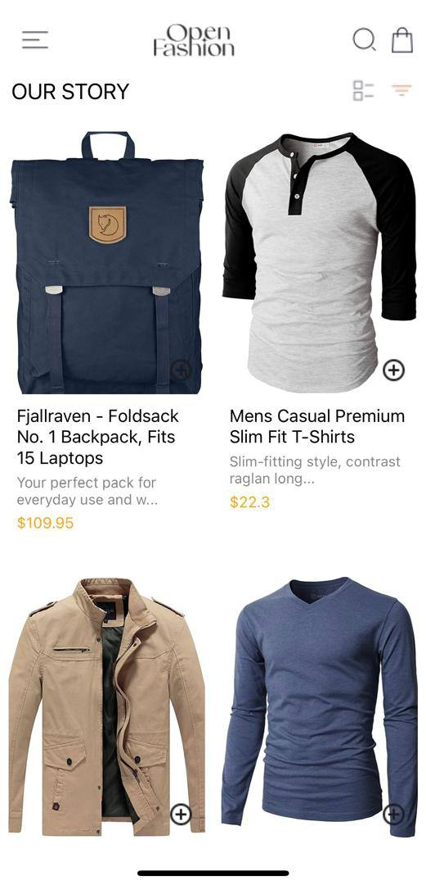
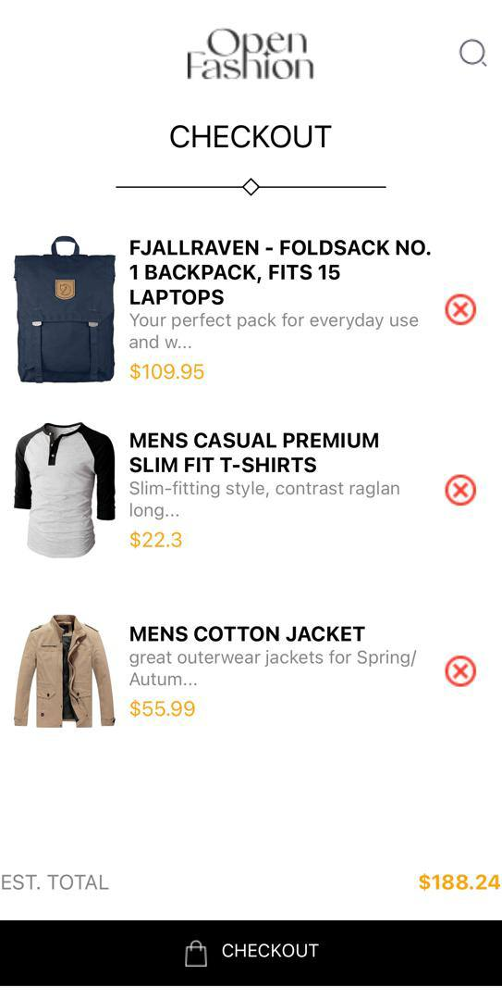

rn-assignment7-11301995

Overview

This project is a React Native application that showcases a product list, product details, and a cart feature. Users can fetch data from an external API, view product details, add products to their cart, and remove products from their cart. The application uses local storage to persist cart items across sessions.

## Features

- HomeScreen: Displays a list of available products.
- ProductDetailScreen: Displays detailed information about a selected product.
- CartScreen: Displays the items added to the cart.
- Drawer Navigation: Accessible through a swipe gesture or button, allowing navigation between screens.
- Add to Cart: Button to add products to the cart.
- Remove from Cart: Button to remove products from the cart.
- Fetch Data: Uses fetch or axios to retrieve data from an external API.
- Async Operations: Manages asynchronous operations with async/await or promises.
- Local Storage: Uses AsyncStorage, SecureStore, or FileSystem to store selected items locally on the device.

Functionality

Users can:
- View a list of available products from an external API.
- Preview detailed information about a product.
- Add products to their cart.
- Remove products from their cart.
- View the items in their cart.

 Installation

1. Clone the repository to your local machine:
     git clone https://github.com/yourusername/rn-assignment7-11301995.git
   2. Navigate to the project directory:
     cd rn-assignment7-11301995
   3. Install the dependencies:
     npm install
   4. Start the development server:
     npx expo start
   
Usage

- HomeScreen: Displays a list of products fetched from the external API.
- ProductDetailScreen: Displays detailed information about a selected product.
- CartScreen: Displays items added to the cart.
- Drawer Navigation: Accessible through a swipe gesture or button, allowing navigation between screens.
- Add to Cart Button: Allows users to add products to the cart.
- Remove from Cart Button: Allows users to remove products from the cart.

 External API

Ensure you have the external API endpoint to fetch the product data. Replace the placeholder URL with the actual API endpoint in your code.

Local Storage

Uses AsyncStorage to store cart items locally on the device.

 Commit Guidelines

- Commit each task separately.
- Use clear and descriptive commit messages.

Screenshots

Contributing

Feel free to fork this repository and submit pull requests. Any enhancements and suggestions are welcome.